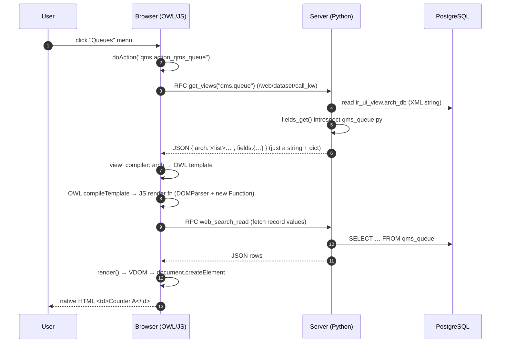
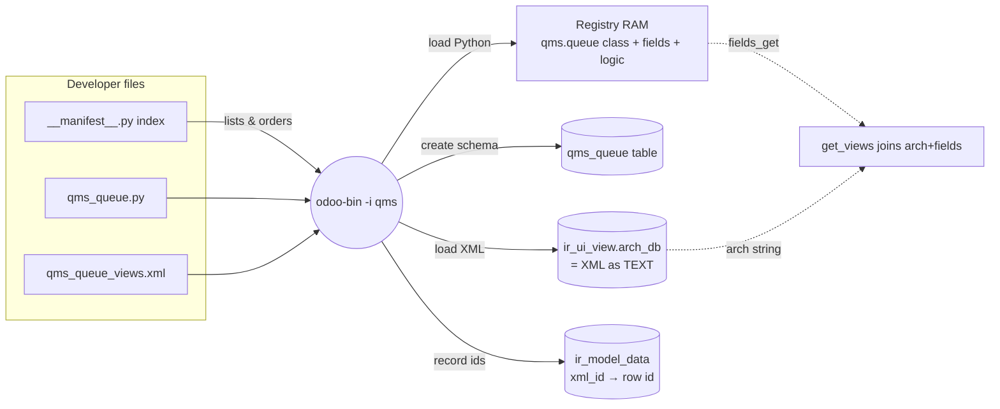

# Odoo Rendering Pipeline — from `.xml`/`.py` files to native HTML

> The journey nobody documents: how a developer's **XML view** + **Python model** become
> **records in a database**, get **fragmented** and **serialized**, travel over **RPC** as a
> **string**, and are turned by **OWL** into **native HTML DOM** in the browser.
>
> Grounded in Odoo 19 source (file:line references are real).

---

## 0. The 30,000-ft timeline — TWO phases

```
        ┌─────────────────────────────────────────────────────────────────────────┐
        │  PHASE A — INSTALL / STARTUP  (happens ONCE, server-side, no browser)     │
        │  Developer FILES  ─digest─►  REGISTRY (RAM) + DATABASE RECORDS             │
        │  After this, the files are never read again at runtime.                   │
        └─────────────────────────────────────────────────────────────────────────┘
                                        │
                                        ▼
        ┌─────────────────────────────────────────────────────────────────────────┐
        │  PHASE B — RUNTIME  (every page interaction)                              │
        │  Browser ──RPC──► Server reads REGISTRY+DB ──JSON string──► OWL ──► HTML  │
        └─────────────────────────────────────────────────────────────────────────┘
```

The two "pure" things produced in Phase A are the only source of truth:
- **Python registry** (model classes + fields + logic) — in RAM, rebuilt from code each boot.
- **PostgreSQL** (records: business data + UI config like the view arch) — on disk.

---

## 1. PHASE A — INSTALL: files become a registry + database records

```
DEVELOPER WRITES (files on server disk)
│
│   __manifest__.py        ← the INDEX: lists which files load + order
│   qms_queue.py           ← Python model (q_name, quid, logic)
│   qms_queue_views.xml    ← view arch (<list>, <form>, <search>)
│   qms_menus.xml          ← menus
│   (actions inside views)
│
└──► odoo-bin -i qms   (install)
        │
        ├─ load Python ──────────────► REGISTRY (in RAM)
        │     qms_queue.py            ┌───────────────────────────────┐
        │     class QmsQueue          │ "qms.queue" → QmsQueue class  │
        │     _name="qms.queue"       │   fields: quid, q_name, ...   │
        │     q_name=fields.Char()    │   methods: create/write/...   │
        │                             └───────────────────────────────┘
        │        │
        │        └─ also CREATES SCHEMA in DB:  CREATE TABLE qms_queue (quid int, q_name varchar, ...)
        │
        └─ load XML data ────────────► DATABASE RECORDS (rows)
              qms_queue_views.xml      ┌───────────────────────────────────────────┐
              <record model=           │ ir_ui_view                                │
                "ir.ui.view">          │   id=512  model='qms.queue'  type='list'  │
                <field name="arch">    │   arch_db = "<list><field name=\"q_name\" │
                  <list>...</list>     │              />...</list>"  ← XML as TEXT  │
                                       ├───────────────────────────────────────────┤
              qms_menus.xml            │ ir_ui_menu  id=88  action=...             │
              actions                  │ ir_actions_act_window  res_model='qms.q…' │
                                       ├───────────────────────────────────────────┤
              every id="..."           │ ir_model_data  (the XML-id ↔ row-id map)  │
                                       │   'qms.action_qms_queue' → 301            │
                                       │   'qms.view_qms_queue_form' → 513         │
                                       └───────────────────────────────────────────┘
```

**Key fragmenting facts:**
- The view **arch XML becomes a TEXT string** in `ir_ui_view.arch_db`
  (`odoo/addons/base/models/ir_ui_view.py:162  arch_db = fields.Text(...)`).
- The model's existence/fields become rows in `ir_model` / `ir_model_fields`.
- Every `id="..."` is recorded in **`ir_model_data`** — the table that resolves
  `module.xml_id → database row id`. **This is the glue table.**

---

## 2. The "EVERYTHING IS A RECORD" map (why one engine renders any app)

```
                         ┌──────────────────────────┐
                         │   PostgreSQL (the DB)     │
                         └──────────────────────────┘
       business data                 │                 UI config (metadata-as-data)
   ┌───────────────────┐             │            ┌──────────────────────────────────┐
   │ qms_queue (rows)  │             │            │ ir_ui_view   ← your <list>/<form> │
   │ qms_ticket (rows) │             │            │ ir_ui_menu   ← your menus          │
   │ ...               │             │            │ ir_actions_* ← your actions        │
   └───────────────────┘             │            │ ir_model / ir_model_fields         │
                                     │            │ ir_model_data ← xml_id → id map     │
                                     │            └──────────────────────────────────┘
   Because the UI itself is just rows, ONE generic web client can render ANY module
   by reading these records. You never write an app — you write declarative DATA.
```

---

## 3. The GLUE — names & XML-ids connect the dots

```
                         "qms.queue"  (the model NAME = the hub)
                                │
        ┌───────────────┬───────┼────────────┬──────────────────┐
        ▼               ▼       ▼            ▼                  ▼
  Python class     DB table   view's      action's        every <field
  (registry)       qms_queue  <field      res_model       name="q_name"/>
                              name="model">"qms.queue"     resolved here
                              qms.queue

        XML-ids  (resolved through ir_model_data)
        ─────────────────────────────────────────
        action_qms_queue ──ref──► menu opens it
        view_qms_queue_search ──ref──► action.search_view_id
        q_name (field name) ──► model def ↔ DB column ↔ <field name="q_name"/>
```

> The developer connects everything by **reusing names**. Odoo resolves those names via the
> **registry** (for model/field names) and **`ir_model_data`** (for XML-ids).

---

## 4. PHASE B — RUNTIME: the request→HTML pipeline (the main event)

```
CLIENT (browser, JS already downloaded as a bundle)                       SERVER (Python)
══════════════════════════════════════════════                ════════════════════════════════

 user clicks "Queues" menu
        │
        ▼
 doAction("qms.action_qms_queue")
        │  (action record already loaded → res_model="qms.queue", view_mode="list,form")
        ▼
 view_service.js:98
   orm.call("qms.queue","get_views",…) ───POST /web/dataset/call_kw/qms.queue/get_views──►
        │                                                                   │
        │                                              ┌────────────────────▼─────────────────┐
        │                                              │ call_kw  (service/model.py:74)        │
        │                                              │   get_public_method → getattr(model)  │
        │                                              │     (blocks names starting with "_")  │
        │                                              ├───────────────────────────────────────┤
        │                                              │ get_views  (ir_ui_view.py:2905)        │
        │                                              │   a) read arch STRING from arch_db     │
        │                                              │   b) fields_get() (models.py:3343):    │
        │                                              │        introspect qms_queue.py →       │
        │                                              │        {q_name:{type:char,string:Name},│
        │                                              │         service_id:{type:many2one,…}}  │
        │                                              │   c) JOIN arch + fields  ← BINDING here │
        │                                              └────────────────────┬──────────────────┘
        │   ◄─────────── JSON: { views:{list:{arch:"<list>…"}}, models:{fields:{…}} } ──────────┘
        ▼            (to the client it is JUST A STRING + a dict)
 ── CLIENT-SIDE TRANSFORMATION (this is "what OWL renders") ──────────────────────────────
        │
        │ ① view_compiler.js  (ViewCompiler:191, compileField:206)   [ODOO'S layer]
        │      arch string  →  an OWL TEMPLATE
        │      <field name="q_name"/>  →  <Field name="q_name" .../>   (widget from fields dict)
        │
        │ ② owl.js compileTemplate (3362)                            [OWL framework]
        │      OWL template string
        │        → new DOMParser().parseFromString(...)   (owl.js:3262)  parse the string
        │        → walk nodes, GENERATE JS source code
        │        → new Function(...)                       → a render() function
        │
        │ ③ render(record.data)                                      [OWL]
        │      function + reactive data (q_name="Counter A")  →  VDOM (block tree)
        │
        │ ④ mount / patch  (owl.js:1110 / document.createElement:1097) [OWL]
        │      document.createElement("td"); el.textContent="Counter A"; insert into page
        │
        │ ⑤ (separate RPC) web_search_read → fetch record VALUES ──────────► server → JSON
        ▼
 BROWSER displays the real DOM nodes  →  <td>Counter A</td>  →  pixels
```

---

## 5. THE HEART — how ONE `<field>` transforms, stage by stage

```
 STAGE          WHERE         WHAT IT IS
 ─────────────────────────────────────────────────────────────────────────────────────
 1. authored    dev file      <field name="q_name"/>                      (you type this)
                qms_queue_views.xml
        │ install
        ▼
 2. stored      server DB      arch_db = "...<field name=\"q_name\"/>..."  (TEXT in a row)
                ir_ui_view
        │ runtime: get_views() reads arch + fields_get()
        ▼
 3. serialized  RPC (wire)     { arch:"<field name='q_name'/>",
                                 fields:{ q_name:{type:'char',string:'Name',required:true} } }
        │                                                              (a STRING + a dict)
        ▼
 4. compiled-1  browser JS     <Field name="q_name" type="char"/>        (OWL component tag)
                view_compiler.js                                          [Odoo translates arch→OWL]
        │
        ▼
 5. compiled-2  browser JS     function render(ctx){ ... CharField ... } (a JS function)
                owl.js compileTemplate    DOMParser + new Function       [OWL]
        │
        ▼
 6. rendered    browser RAM    VDOM: { tag:'td', text: ctx.record.data.q_name }   (virtual)
                owl.js render()
        │  + data  q_name = "Counter A"
        ▼
 7. mounted     browser DOM    <td>Counter A</td>                        (REAL HTML node)
                document.createElement
        │
        ▼
 8. displayed   screen         Counter A                                 (pixels)
```

> The browser is handed your XML **never**. It is handed a JS bundle that, at stage 5–7,
> **creates the HTML itself** with `document.createElement`. "Browser knows only HTML" holds —
> OWL is JS, and JS *makes* HTML.

---

## 6. WHERE EVERYTHING LIVES (memory map)

```
 ┌── SERVER (your PC, Odoo process) ─────────────────────────────────────────────┐
 │  RAM  : Python REGISTRY  (qms.queue class, fields, create/write/compute logic) │
 │  DISK : PostgreSQL        (qms_queue rows  +  ir_ui_view.arch_db = your XML)    │
 │  FILES: qms_queue.py, qms_queue_views.xml  (only read at install; the SOURCE)   │
 └────────────────────────────────────────────────────────────────────────────────┘
                       │  ORM serializes registry+DB → JSON
        ═══════════════▼═══════════ NETWORK (RPC / JSON-RPC over HTTP) ═══════════
                       ▼
 ┌── BROWSER (client) ───────────────────────────────────────────────────────────┐
 │  the downloaded JS BUNDLE  (web.assets_web.min.js — OWL + Odoo web framework)   │
 │  arch STRING + fields dict + record VALUES  (received over RPC, held in memory) │
 │  the live DOM tree         (what OWL built; what you see)                       │
 │  NO source files. NO truth. Refresh → ask the server again.                    │
 └────────────────────────────────────────────────────────────────────────────────┘
```

---

## 7. WHO DOES WHAT (division of labor)

```
 BROWSER  : runs JS, knows HTML/CSS, executes document.createElement
 OWL      : template STRING → JS function → VDOM → real DOM   (the generic engine)
 ODOO     : the bridge that feeds OWL —
            • server: get_views + fields_get (ship arch string + field metadata)
            • client: view_compiler (arch → OWL template), fields registry (type → widget),
                      ListRenderer/FormRenderer, RelationalModel (reactive data), rpc/orm
 DEVELOPER: writes declarative .xml + .py using consistent NAMES
```

---

## 8. Mermaid — the runtime sequence (renders in VS Code / GitHub)



## 9. Mermaid — install-time fragmentation



---

## 10. One-sentence summary

> The developer writes **files full of consistent names**; at **install** Odoo compiles them into
> a **Python registry** (code) + **database records** (the view arch stored as a *string*), linked
> by those names via **`ir_model_data`**; at **runtime** a **generic engine** serializes registry+DB
> to **JSON**, ships the arch **as a string** over **RPC**, and **OWL** (JavaScript) turns that string
> into a **render function** that calls **`document.createElement`** to build the **native HTML** the
> browser finally paints. Files → records → string → JS → DOM.
